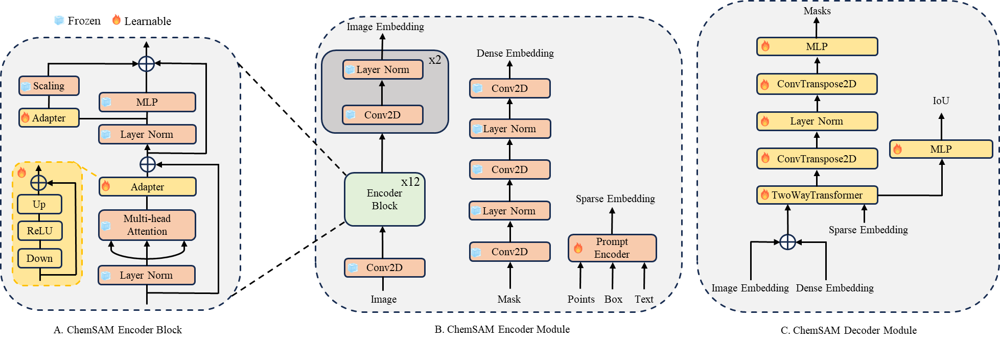

# ChemSAM

This is the repository for ChemSAM, a document-to-structure model that translates a document to its chemical
structure. 




## Quick Start

### Installation Environment
Install the required packages with conda
```
conda env create -f environment.yaml
```

### Model
Download the ChemSAM model from [Goole Drive](https://drive.google.com/file/d/1qZi8sQ-xV952dB5gtg7p1sR765ibMsoz/view?usp=sharing) 
and place the downloaded model parameters in the .logs/chemseg_pix_sdg_2023_09_08_19_02_14/Model/ folder.
```
cd .logs/chemseg_pix_sdg_2023_09_08_19_02_14/Model/
wget -P .logs/chemseg_pix_sdg_2023_09_08_19_02_14/ https://drive.google.com/file/d/1qZi8sQ-xV952dB5gtg7p1sR765ibMsoz/view?usp=sharing
unzip ChemSAM_Model.zip
```

### Pre-Training Data
In detail, we created a total of 10,774 samples and masks for model to pre-training. The pre-training data download link is [Goole Drive](https://drive.google.com/file/d/1RZBpDk4EkM7UI9QDV5gdP2x2iVmqtlR5/view?usp=sharing) 

### Prediction
```
python predict.py
```

ChemSAM was be used in PROTACT database project [Linker](https://wxfsd.github.io/index.html)

### Example
Input: ./testpdf/acs.jmedchem.0c00456.pdf
Output: ./splitresult/*.png

### Cite
If you use ChemSAM in your research, please cite our [paper]().
```
@article{
    ChemSAM,
    title = {{ChemSAM}: Automated Molecular Structure Extraction from Documents Using ChemSAM},
}
```
